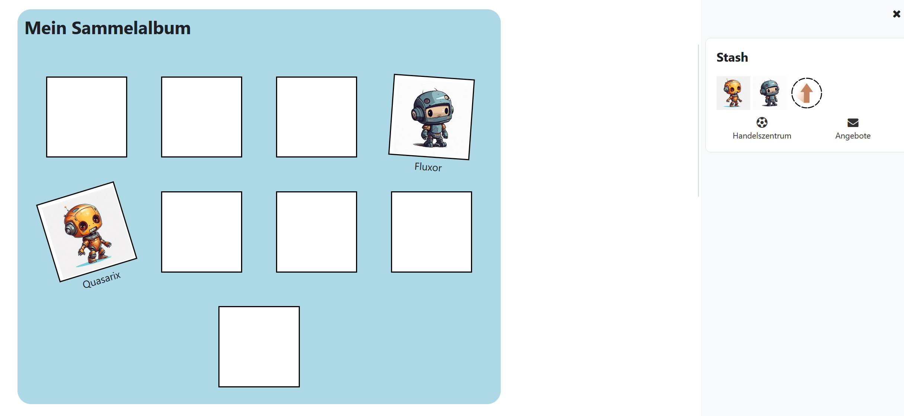

# Stash Album

Items in block_stash can be displayed as a photo album

## Getting started

1. Create in moodle a block stash with view on each page.
2. Add your items.
3. Copy the album code into a text field or text page.
4. Within ```<div class="albumstash">``` add divs with the class photostash or change the existing ones. Adjust the id to the title of the objects. However, write the id in lower case and remove spaces.

Example: The object with the title "My item" becomes
```<div id="myitem" class="photostash"></div>```

## Screenshot

